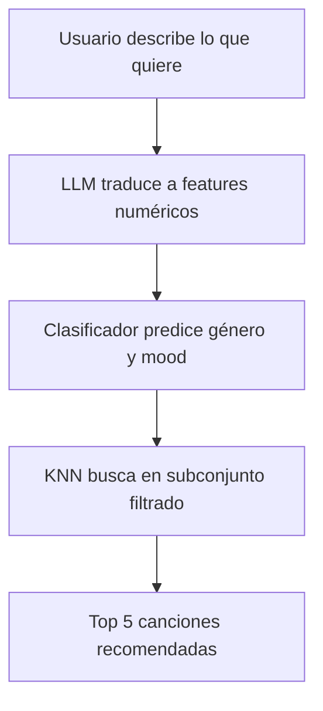

# Music Mood Recommender

##Integrantes

- Miguel Garcia
- Juan Ignacio Lotero Franco

## Planteamiento del problema

Las plataformas de música recomiendan canciones basándose en el historial de escucha, pero no permiten describir en lenguaje natural cómo se siente el usuario.

**Pregunta:** ¿Cómo recomendar canciones basándose en una descripción textual del estado de ánimo?

**Ejemplo:** Si el usuario escribe "algo triste y lento para una noche de lluvia", el sistema debe devolver canciones con valence baja (triste), tempo lento y energía baja.

## Objetivo general

Construir un sistema que:

1. Reciba una descripción en lenguaje natural del estado de ánimo
2. Traduzca esa descripción a características musicales usando Gemini
3. Clasifique el género y mood aproximado
4. Filtre el catálogo de Spotify a ese género
5. Use KNN para encontrar las canciones más cercanas
6. Devuelva las 5 mejores recomendaciones en una interfaz web

## Diagrama de flujo


## Metodología

### Etapa 1: LLM (Gemini)
Convierte frases como "algo triste y lento" en valores numéricos:
- valence = 0.2 (triste)
- energy = 0.3 (baja energía)
- tempo = 80 (lento)

### Etapa 2: Clasificador
Predice el género musical y el estado de ánimo (sad, neutral, happy)

### Etapa 3: Filtrado
Reduce el dataset de ~20,000 canciones a solo las de ese género (~2,000 canciones)

### Etapa 4: KNN con similitud de coseno
Encuentra las 5 canciones más parecidas a la descripción del usuario

## Dataset

**Fuente:** Spotify Music Dataset (Kaggle) - solomonameh/spotify-music-dataset

**Registros:** ~20,000 canciones

**Columnas seleccionadas:**

| Columna | Qué significa |
|---------|---------------|
| valence | Qué tan triste (0) o feliz (1) es la canción |
| energy | Qué tan calmada (0) o enérgica (1) es |
| tempo | Velocidad en BPM (60=lento, 120=normal, 200=rápido) |
| track_name | Nombre de la canción |
| track_artist | Artista |
| playlist_genre | Género musical (indie, pop, rock, etc.) |

## Resultados

| Componente | Métrica | Valor |
|------------|---------|-------|
| Clasificador de género | Accuracy | (por definir - lo pone tu compañero cuando termine) |
| KNN | Precisión en recomendaciones | (por definir después de pruebas manuales) |

### Ejemplo de salida

**Usuario:** "algo triste y lento para una noche de lluvia"

| # | Canción | Artista | Género |
|---|---------|---------|--------|
| 1 | Skinny Love | Bon Iver | indie folk |
| 2 | Holocene | Bon Iver | indie folk |
| 3 | Roslyn | Bon Iver | indie folk |
| 4 | The Night We Met | Lord Huron | indie folk |
| 5 | To Build A Home | The Cinematic Orchestra | chamber folk |

## Resultados del Clasificador de Género

Se entrenó un clasificador para predecir el género musical (calm, electronic, pop, rock, urban, world) a partir de las características de audio.

### Resumen de resultados

| Conjunto | Accuracy |
|----------|----------|
| Entrenamiento | 96% |
| Validación | 22% |
| Prueba | 19% |

### Reporte detallado - Entrenamiento

| Género | Precisión | Recall | F1-score |
|--------|-----------|--------|----------|
| calm | 0.96 | 0.96 | 0.96 |
| electronic | 0.95 | 0.95 | 0.95 |
| pop | 0.95 | 0.96 | 0.95 |
| rock | 0.95 | 0.96 | 0.96 |
| urban | 0.96 | 0.95 | 0.95 |
| world | 0.97 | 0.95 | 0.96 |

**Accuracy (train):** 0.96

### Reporte detallado - Validación

| Género | Precisión | Recall | F1-score |
|--------|-----------|--------|----------|
| calm | 0.24 | 0.43 | 0.31 |
| electronic | 0.16 | 0.10 | 0.12 |
| pop | 0.26 | 0.37 | 0.31 |
| rock | 0.19 | 0.07 | 0.10 |
| urban | 0.05 | 0.02 | 0.03 |
| world | 0.17 | 0.08 | 0.11 |

**Accuracy (val):** 0.22

### Reporte detallado - Prueba

| Género | Precisión | Recall | F1-score |
|--------|-----------|--------|----------|
| calm | 0.23 | 0.43 | 0.30 |
| electronic | 0.21 | 0.13 | 0.16 |
| pop | 0.19 | 0.25 | 0.21 |
| rock | 0.08 | 0.04 | 0.05 |
| urban | 0.07 | 0.03 | 0.04 |
| world | 0.08 | 0.04 | 0.05 |

**Accuracy (test):** 0.19

### Análisis

El clasificador muestra **sobreajuste (overfitting) significativo**: funciona excelente en entrenamiento (96%) pero muy mal en validación y prueba (~20%). Esto indica que el modelo memorizó los datos de entrenamiento pero no logra generalizar a datos nuevos. Se requiere más regularización o un modelo más simple.

## Pruebas del Asistente Musical

El asistente puede explicar las recomendaciones y responder preguntas del usuario.

### 1. Contexto de las recomendaciones
El usuario pide el contexto completo de las canciones recomendadas.


### 2. Evaluación de las recomendaciones
El usuario pregunta qué tan bien se ajustan las canciones a su descripción.


### 3. Selección de una canción
El usuario pide una recomendación específica dentro de las 5 canciones.


## Resultados del sistema

### Ejemplo 1: "algo alocado"


### Ejemplo 2: "algo movido pero triste"


## Discusión

### Comparación con Spotify

| Sistema | Fortaleza | Debilidad |
|---------|-----------|-----------|
| Spotify | Basado en historial del usuario | No acepta descripciones en lenguaje natural |
| Nuestro sistema | Acepta lenguaje natural | Más lento, depende del LLM |

### Limitaciones

1. El dataset tiene solo ~20,000 canciones
2. El clasificador puede tener errores
3. Gemini puede malinterpretar descripciones ambiguas

### Trabajo futuro

1. Agregar más canciones al dataset
2. Permitir feedback del usuario para mejorar recomendaciones

## Cómo ejecutar

### Instalar dependencias

```bash
pip install kagglehub pandas scikit-learn google-generativeai gradio python-dotenv

